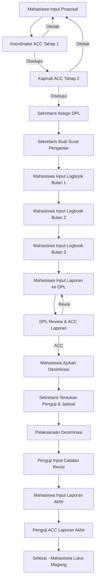

# Implementation Plan: Sistem Pengelolaan Magang Prodi Sistem Informasi

## Overview

Sistem ini adalah aplikasi pengelolaan magang untuk Program Studi Sistem Informasi berbasis **CodeIgniter 3** dengan database **PostgreSQL**. Sistem memiliki 6 role pengguna dengan hak akses berbeda sesuai dengan dokumen analisis yang diberikan.

## User Review Required

> [!IMPORTANT]
> **Database Schema**: Akan dibuat skema database lengkap dengan 12+ tabel. Pastikan PostgreSQL sudah terinstall dan database `db_magang` dapat diakses.

> [!WARNING]
> **Data Existing**: Beberapa tabel sudah ada (users, roles, mahasiswa, proposal_magang). Migrasi akan menambah kolom baru dan tabel baru tanpa menghapus data existing.

---

## Role & Permission Matrix

| Role ID | Role | Hak Akses Utama |
|---------|------|-----------------|
| 1 | Ketua Program Studi | ACC tahap 2 proposal |
| 2 | Koordinator Pengelola Magang | ACC tahap 1 proposal, monitoring logbook |
| 3 | Sekretaris Program Studi | Administrasi lengkap (DPL, surat, jadwal, dashboard) |
| 4 | Dosen Pembimbing Lapangan | Review logbook & laporan mahasiswa |
| 5 | Mahasiswa | Input proposal, logbook, laporan |
| 6 | Penguji Desiminasi | Review & ACC laporan akhir |

---

## Proposed Changes

### Database Schema

#### [NEW] [migration.sql](file:///c:/laragon/www/Magang/database/migration.sql)

Schema PostgreSQL lengkap untuk semua tabel yang diperlukan:

```sql
-- Tables to create/modify:
-- 1. roles (existing, verify structure)
-- 2. users (existing, verify structure)
-- 3. mahasiswa (existing, add columns)
-- 4. dosen (new, complete data)
-- 5. proposal_magang (existing, verify)
-- 6. logbook_magang (new)
-- 7. laporan_magang (new)
-- 8. desiminasi (new)
-- 9. surat_pengantar (new)
-- 10. jadwal_desiminasi (new)
-- 11. mitra_kerjasama (new)
-- 12. sebaran_magang (new)
```

---

### Models (application/models/)

#### [NEW] [Logbook_model.php](file:///c:/laragon/www/Magang/application/models/Logbook_model.php)
- CRUD logbook per bulan (bulan 1-3)
- Get logbook by mahasiswa
- Get logbook by DPL

#### [NEW] [Laporan_model.php](file:///c:/laragon/www/Magang/application/models/Laporan_model.php)
- Upload laporan hasil magang
- Update status review DPL
- Get laporan by mahasiswa/DPL

#### [NEW] [Desiminasi_model.php](file:///c:/laragon/www/Magang/application/models/Desiminasi_model.php)
- Pengajuan desiminasi
- Jadwal desiminasi
- Hasil desiminasi

#### [NEW] [Administrasi_model.php](file:///c:/laragon/www/Magang/application/models/Administrasi_model.php)
- Penugasan DPL
- Surat pengantar magang
- Penugasan penguji desiminasi

#### [NEW] [Dashboard_model.php](file:///c:/laragon/www/Magang/application/models/Dashboard_model.php)
- Mitra kerjasama
- Sebaran magang per wilayah
- Sebaran magang per jenis

#### [MODIFY] [Dosen_model.php](file:///c:/laragon/www/Magang/application/models/Dosen_model.php)
- Complete CRUD operations
- Get students by DPL
- Get assigned examiner

#### [MODIFY] [Mahasiswa_model.php](file:///c:/laragon/www/Magang/application/models/Mahasiswa_model.php)
- Add more fields and methods
- Get mahasiswa with DPL info

---

### Controllers by Role

#### Mahasiswa Controllers (application/controllers/)

##### [MODIFY] [dashboard/Mahasiswa.php](file:///c:/laragon/www/Magang/application/controllers/dashboard/Mahasiswa.php)
- Dashboard lengkap dengan menu
- Info mitra kerjasama
- Info sebaran magang

##### [NEW] [logbook/Logbook.php](file:///c:/laragon/www/Magang/application/controllers/logbook/Logbook.php)
- Input link drive logbook bulan 1-3
- Lihat status logbook

##### [NEW] [laporan/Laporan.php](file:///c:/laragon/www/Magang/application/controllers/laporan/Laporan.php)
- Input laporan untuk review DPL
- Input laporan akhir setelah desiminasi

##### [NEW] [desiminasi/Desiminasi.php](file:///c:/laragon/www/Magang/application/controllers/desiminasi/Desiminasi.php)
- Pengajuan desiminasi
- Lihat jadwal & penguji
- Input revisi laporan akhir

---

#### Koordinator Controllers

##### [NEW] [dashboard/Koordinator.php](file:///c:/laragon/www/Magang/application/controllers/dashboard/Koordinator.php)
- Dashboard koordinator
- List proposal (ACC tahap 1)
- Monitoring logbook
- Lihat hasil ACC penguji

---

#### Sekretaris Controllers

##### [NEW] [dashboard/Sekretaris.php](file:///c:/laragon/www/Magang/application/controllers/dashboard/Sekretaris.php)
- Dashboard sekretaris

##### [NEW] [admin/Sekretaris.php](file:///c:/laragon/www/Magang/application/controllers/admin/Sekretaris.php)
- Penentuan DPL untuk mahasiswa
- Input surat pengantar magang
- Penentuan penguji desiminasi
- Input jadwal desiminasi
- Kelola konten dashboard info

---

#### DPL Controllers

##### [NEW] [dashboard/Dosen.php](file:///c:/laragon/www/Magang/application/controllers/dashboard/Dosen.php)
- Dashboard DPL
- List mahasiswa bimbingan
- Monitoring logbook mahasiswa
- Review & ACC laporan
- Lihat jadwal desiminasi

---

#### Kaprodi Controllers

##### [NEW] [dashboard/Kaprodi.php](file:///c:/laragon/www/Magang/application/controllers/dashboard/Kaprodi.php)
- Dashboard kaprodi
- ACC tahap 2 proposal

---

#### Penguji Controllers

##### [NEW] [dashboard/Penguji.php](file:///c:/laragon/www/Magang/application/controllers/dashboard/Penguji.php)
- Dashboard penguji
- Konfirmasi kesediaan menguji
- ACC laporan akhir mahasiswa
- Input catatan & revisi

---

### Views (application/views/)

#### Layout

##### [NEW] [layouts/header.php](file:///c:/laragon/www/Magang/application/views/layouts/header.php)
- Header dengan navigasi dinamis per role

##### [NEW] [layouts/footer.php](file:///c:/laragon/www/Magang/application/views/layouts/footer.php)
- Footer dengan script

##### [NEW] [layouts/sidebar.php](file:///c:/laragon/www/Magang/application/views/layouts/sidebar.php)
- Sidebar menu dinamis per role

---

#### Dashboard Views

##### [MODIFY] [dashboard/mahasiswa.php](file:///c:/laragon/www/Magang/application/views/dashboard/mahasiswa.php)
- Complete dashboard dengan info mitra & sebaran

##### [NEW] [dashboard/koordinator.php](file:///c:/laragon/www/Magang/application/views/dashboard/koordinator.php)
##### [NEW] [dashboard/sekretaris.php](file:///c:/laragon/www/Magang/application/views/dashboard/sekretaris.php)
##### [NEW] [dashboard/dosen.php](file:///c:/laragon/www/Magang/application/views/dashboard/dosen.php)
##### [NEW] [dashboard/kaprodi.php](file:///c:/laragon/www/Magang/application/views/dashboard/kaprodi.php)
##### [NEW] [dashboard/penguji.php](file:///c:/laragon/www/Magang/application/views/dashboard/penguji.php)

---

#### Feature Views

##### [NEW] [logbook/index.php](file:///c:/laragon/www/Magang/application/views/logbook/index.php)
- Form input logbook bulanan

##### [NEW] [laporan/index.php](file:///c:/laragon/www/Magang/application/views/laporan/index.php)
- Form upload laporan

##### [NEW] [desiminasi/index.php](file:///c:/laragon/www/Magang/application/views/desiminasi/index.php)
- Pengajuan desiminasi

##### [NEW] [admin/kelola_dpl.php](file:///c:/laragon/www/Magang/application/views/admin/kelola_dpl.php)
- Penugasan DPL

##### [NEW] [admin/surat_pengantar.php](file:///c:/laragon/www/Magang/application/views/admin/surat_pengantar.php)
- Kelola surat pengantar

##### [NEW] [admin/jadwal_desiminasi.php](file:///c:/laragon/www/Magang/application/views/admin/jadwal_desiminasi.php)
- Kelola jadwal desiminasi

##### [NEW] [admin/dashboard_content.php](file:///c:/laragon/www/Magang/application/views/admin/dashboard_content.php)
- Kelola konten info dashboard

---

## Alur Proses Bisnis Mahasiswa



---

## Verification Plan

### Automated Tests
1. Database connection test
2. Authentication flow test (login/logout per role)
3. Role-based access control verification

### Manual Verification
1. Login sebagai setiap role dan verifikasi menu yang muncul
2. Test alur lengkap dari pengajuan proposal hingga selesai
3. Verifikasi semua fitur dashboard info
4. Test ACC/reject di setiap tahap approval

---

## Implementation Order

1. **Database Schema** - Create migration.sql
2. **Models** - Create all required models
3. **Layout Views** - Create master layout
4. **Dashboard Controllers & Views** - Per role
5. **Proposal Flow** - Complete existing flow
6. **Logbook Feature** - CRUD logbook
7. **Laporan Feature** - CRUD laporan
8. **Desiminasi Feature** - Complete flow
9. **Admin Features** - Sekretaris management
10. **Dashboard Info** - Mitra & Sebaran data

